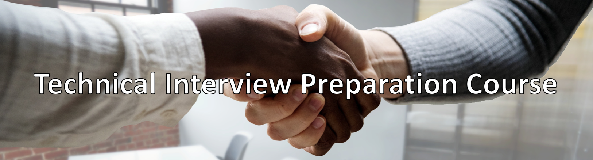

This course is designed to help Information Systems prepare for technical interviews by learning key concepts, practicing coding challenges, and reviewing solutions. Although designed specifically to help Information Students this course can assist anyone striving to improve in their technical interviewing skills. This course is complete self-taught and provides all necessary links and practices to ensure its students success.

The course contains content for the following classes:
- Class 1: Course Introduction
- Class 2: Problem Solving Skills
- Class 3: Recursion Problems
- Class 4: Array Problems (Easy)
- Class 5: Array Problems (Medium)
- Class 6: Frontend Interviews
- Class 7: Merge Sort
- Class 8: Dictionary Problems (Easy)
- Class 9: Dictionary Problems (Medium)
- Class 10: Backend Interviews
- Class 11: Linked List Problems (Easy)
- Class 12: Linked List Problems (Medium)
- Class 13: QuickSort
- Class 14: Trees
- Class 15: System Design Interviews
- Class 16: Final and Reflection
